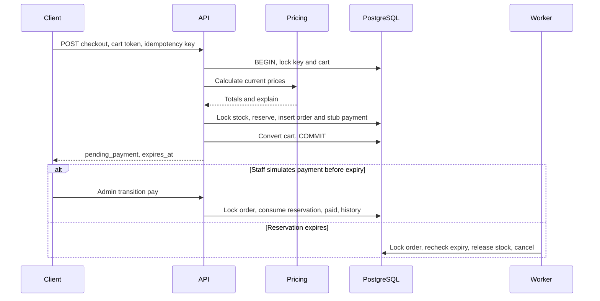
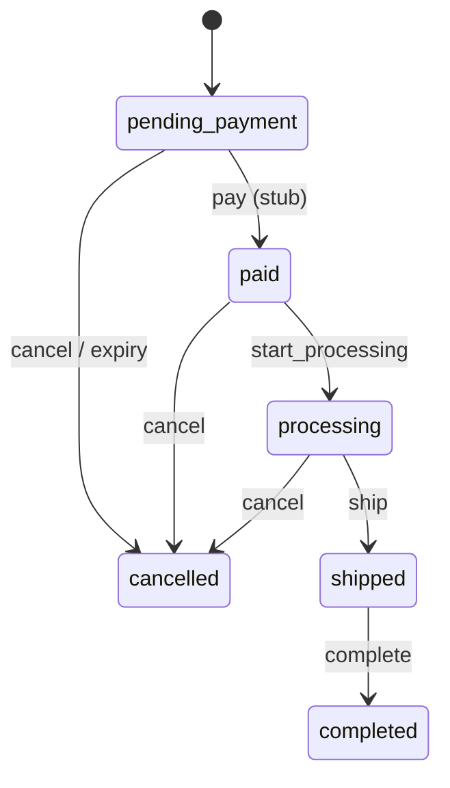

# Потік покупки

```mermaid
sequenceDiagram
    participant Client
    participant API
    participant Pricing
    participant DB as PostgreSQL
    participant Worker
    Client->>API: POST checkout, cart token, idempotency key
    API->>DB: BEGIN, lock key and cart
    API->>Pricing: Calculate current prices
    Pricing-->>API: Totals and explain
    API->>DB: Lock stock, reserve, insert order and stub payment
    API->>DB: Convert cart, COMMIT
    API-->>Client: pending_payment, expires_at
    alt Staff simulates payment before expiry
        Client->>API: Admin transition pay
        API->>DB: Lock order, consume reservation, paid, history
    else Reservation expires
        Worker->>DB: Lock order, recheck expiry, release stock, cancel
    end
```

```mermaid
stateDiagram-v2
    [*] --> pending_payment
    pending_payment --> paid: pay (stub)
    pending_payment --> cancelled: cancel / expiry
    paid --> processing: start_processing
    paid --> cancelled: cancel
    processing --> shipped: ship
    processing --> cancelled: cancel
    shipped --> completed: complete
```
